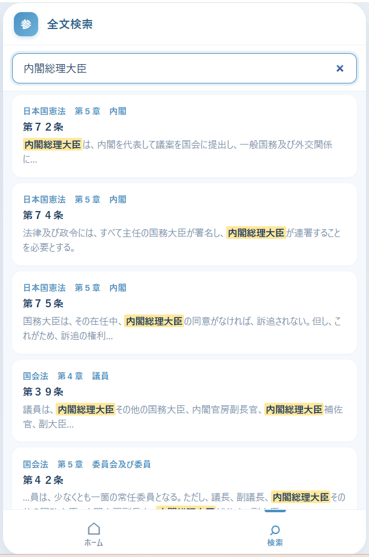

# 参議院法規先例アプリ

参議院の**法規（国会法・参議院規則・各種規程 等）**と**先例（参議院先例録・委員会先例録）**を、
一元的に閲覧・全文検索でき、条文や先例を相互リンクでたどれるブラウザ参照型Webアプリです。
現場で感じた「引きにくさ」を解決するために個人で開発しました。

---

## 課題（何が不便だったか）

- 法規・先例は条文／先例の数が膨大で、**紙の冊子や公式PDFに分散**しており、必要な箇所を素早く引けない。
- 先例録は「**章 → 節 → 款**」の階層で構成され、**先例どうしの参照**や**法規条文への参照**が多数あるが、紙やPDFでは関連を追うのが困難。
- 公式PDFは**縦書き**で、検索もリンクもできず、目的の条文・先例にたどり着くまでに時間がかかる。

---

## 解決策（何を作ったか）

- 法規と先例を横断的に閲覧・全文検索でき、参照を**相互リンク**でたどれるWebアプリを開発。
- 公式の縦書きPDFから、**章/節/款の階層・先例番号・関連法規・参照先例**を構造化データ（JSON）として抽出する**データ整備パイプラインを自作**。
- **ビルド不要の静的サイト**として実装。サーバに置くだけで動き、ブラウザでの参照利用を想定（外部サービスに依存しない）。
- 公文書としての**体裁・正確性の忠実な再現**を最重視し、機械チェックと目視確認の二重で検品。

---

## 機能一覧

### 閲覧・検索
- 法規閲覧：8法令の条文一覧／条文詳細
- 先例閲覧：参議院先例録（全32章・586先例）／委員会先例録（全20章・422先例）
- 章 → 節 → 款 の**入れ子折りたたみ**表示で、目的の先例まで素早く到達
- 全文検索：番号・タイトル・本文を横断検索

### 相互参照リンク
- **先例 → 法規**：本文中の「国第〇条」「規第〇条」等を、該当条文へワンタップ遷移（チップ表示）
- **先例 → 先例**：参照先例の番号から該当先例へ遷移（参議院／委員会の系統をまたいで誤って飛ばないよう参照解決を制御）

### 公文書体裁の忠実再現
- 先例番号は「〇号」表記、諸表参照は号を付けない等の表記ルールを反映
- 準用条の鍵括弧「」と丸括弧（）を文脈に応じて使い分け
- 段落改行・項番（一）（二）・引用ブロック・表組みを原典どおりに保持

---

## 技術スタック

| 区分 | 使用技術 |
|---|---|
| フロントエンド | HTML / CSS / Vanilla JavaScript（フレームワーク・ビルドツール不使用の静的SPA） |
| データ | JSON（章/節/款の階層、先例・条文・参照を構造化） |
| データ抽出 | Python + pdfplumber（縦書きPDFの列クラスタリング解析、参照・項番マーカーの復元） |
| データ保存 | localStorage（お気に入り機能） |
| デプロイ | 静的ファイル配信（GitHub Pages） |

---

## データ品質への取り組み

公文書を扱うため正確性を最重視し、以下の観点で自動チェックするスクリプトを整備しました。

- 通し番号の連続性
- 括弧の開閉整合
- 参照の解決可否
- 法規リンクの整合
- 鍵括弧の文脈整合
- 項番マーカーの段崩れ検出

全先例を機械チェックした上で、章ごとに目視確認するプロセスで検品しています。

---

## 開発の背景

参議院事務局に勤務する中で、法規・先例を調べる際の非効率さを長年感じていました。
膨大な条文と先例が縦書きPDFや紙冊子に分散しており、参照関係を手作業でたどる必要がありました。
このアプリは、その課題を自分自身で解決するために個人で開発したものです。

---

## スクリーンショット

### ホーム画面

### 閲覧画面

### 先例詳細・検索

---

## 注意事項

- 本アプリは個人の学習・研究目的で開発したものです。
- データは公開情報をもとに整備していますが、正確性・最新性は保証しません。
- 実務利用の際は必ず一次情報（公式冊子・e-Gov等）を参照してください。
